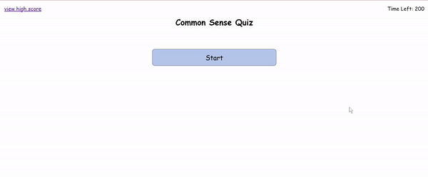

# code-quiz

## Technology Used
- html
- javascript
- css
- [ezgif](https://ezgif.com/): to convert a screen recording to gif file for demo listed here.

## Description 
This is a product of a challenge provided by UC Berkeley Extension Coding Bootcamp

This is a common sense quiz that provides pre-selected questions for the user, and times it.
Every time the user selects an answer, it determines if it's right or wrong.
When the user gets it right, display "correct!" message and when the user gets it wrong, "come on... it's a common sense.." is displayed.
Also when the user gets the answer wrong, it subtracts 30 seconds from the timer

This was done while trying to accomplish following criteria:

### Acceptance Criteria
- GIVEN I am taking a quiz
1. WHEN I click the start button
THEN a timer starts and I am presented with a question
2. WHEN I answer a question
THEN I am presented with another question
3. WHEN I answer a question incorrectly
THEN time is subtracted from the clock
4. WHEN all questions are answered or the timer reaches 0
THEN the game is over
5. WHEN the game is over
THEN I can save my initials and score

[Deployed Wepsite](https://moonjunsain.github.io/common-sense-quiz/)

## Table of Contents

* [Installation](#installation)
* [Usage](#usage)
* [Credits](#credits)
* [License](#license)

## Installation

N/A

## Usage 

Following is the demo of this app.
The user can use mouse to click the answer, type in their initial, and it gets stored in their local storage for displaying them on high score page.

## Credits

### June Moon
- Email: moonjunsain@gmail.com
- [Github](https://github.com/moonjunsain)
- [Linkedin](https://www.linkedin.com/in/june-moon-940538280/)

## License

MIT License

---

© 2023 edX Boot Camps LLC. Confidential and Proprietary. All Rights Reserved.